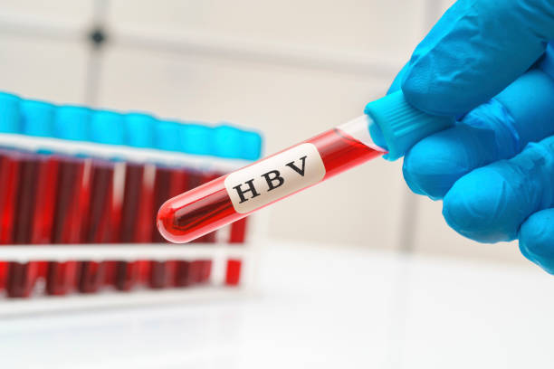

# Hepatitis-B Prediction Web App




## Click below to view the Web App
[](https://siddhantt-k-hepatitis-b-disease-app-86hura.streamlitapp.com/)


### Demo Video

#### Video walk-through of Web App -

https://user-images.githubusercontent.com/87244972/181458574-7bbdd4e2-92a4-4edb-a8ca-09f2df54fd63.mp4


## Key findings: Few important features like Age, Albumin, Protime and Bilirubin have a higher weightage on the decision making of whether a person is going to live or die.


## Author

- [@Siddhantt-K](https://www.github.com/Siddhantt-K)

## Table of Contents

  - [Business problem](#business-problem)
  - [Data source](#data-source)
  - [Workflow](#workflow)
  - [Tech Stack](#tech-stack)
  - [Quick glance at the results](#quick-glance-at-the-results)
  - [Deployment on streamlit](#deployment-on-streamlit)
  - [Repository structure](#repository-structure)


## Business problem

This web app predicts a person who is suffering from Hepatitis B Virus is going to live or die. The web app uses different information about the person's medical test and then based on this test the decision is made of a persons survival. Usually Age and tests like Albumin, Protime, Bilirubin have a higher impact on a decision making of persons survival. It depends on other features as well.


## Data source

- [Hepatitis Dataset](https://archive.ics.uci.edu/ml/datasets/hepatitis)


## Workflow

- Data Preparation : Added column names and also done the formation as the data was not neatly organized.
                     Converted features to their respective datatypes.
                     Handled missing values with the measure of central tendency.

- Exploratory Data Analysis(EDA) : Descriptive Analytics.
                                   Checked and plotted the value counts of the sex feature and target variable using Bar Plot.
                                   Plotted frequency distribution table(with Pie Chart) using Age range and derived the conclusion that highest prevalence of Hepatitis is from age 30-40 followed by 40-50. The least is under age 10 and elderly above 70.
                                   Checked for the outliers using Univariate Analysis, Multivariate Analysis and also using IQR range.

- Feature Selection : Used 3 methods namely 1)Select K Best, 2)Recursive Feature Elimination and 3)Extra Tree Classifier
                      method to get the best features which have strong relationship and influence on the data.

- Model Building : Used Standardization technique to perform feature scaling.
                   Performed 3 algorithms on the data- 1)Logistic Regression, 2)K Nearest Neighbor(KNN) and 3)Random Forest .
                   Used K Fold Cross Validation technique to get the performance of each algorithm.
                   Since the data was imbalanced so performed Undersampling and Oversampling technique to make it balance and again performed above 3 algorithms on the balanced data to check the performance of the model.

- Serialization of Model : Saved the models using Joblib.

- Evaluation of Model : Confusion Matrix, Classification Report.

- Interpretation of the model : Used methods like Lime and Eli5 for interpreting the model.

- Production with Streamlit : Created a web app using Streamlit.


## Tech Stack

- Python (refer to requirement.txt file for the packages used in this project)
- Streamlit (interface for the model)


## Quick glance at the results

- Class of the data(Imbalanced) -


- Class of the data(Balanced) -


- Frequency distribution using Age range -


- Feature Selection using SelectKBest method - 


- Feature Selection using Recursive Feature Elimination method - 


- Feature Selection using Extra Tree Classifier method - 


- Interpretation using Lime -


- Interpretation using Eli5 - 


## Deployment on streamlit

To deploy this project on streamlit share, follow these steps:

- first, make sure you upload your files on Github, including a requirements.txt file
- go to [streamlit share](https://share.streamlit.io/)
- login with Github, Google, etc.
- click on new app button
- select the Github repo name, branch, python file with the streamlit codes
- click advanced settings, select python version 3.9 and add the secret keys if your model is stored on AWS or GCP bucket
- then save and deploy!

## Repository structure

```

├── assets
│   ├── 1.jpg                                         <- Image used in web app
│   ├── 2.jpg                                         <- Image used in web app
│   ├── icon.jpg                                      <- Streamlit web app icon image
│   ├── HBV.jpg                                       <- banner image used in the README
│   ├── imbalanced_class.png                          <- Image of imbalanced class counts.
│   ├── balanced_class.png                            <- Image of balanced class counts.
│   ├── frequency_count_age.png                       <- Image of bar plot for frequency distribution of Age range.
│   ├── frequency_count_age_piechart.png              <- Image of pie chart for frequency distribution of Age range.
│   ├── best_features_usingSKB.png                    <- A picture of the top 12 features using Select K Best.
│   ├── best_features_usingRFE.png                    <- A picture of the features using Recursive Feature Elimination 
│   ├── best_features_usingExtraTreeClf.png           <- A picture of the top 10 features using Extra Tree Classifier
│   ├── model_interpretation_lime.png                 <- Image of Lime Interpretor 
│   ├── model_interpretation_eli5.png                 <- Image of Eli5 Interpretor 
│
├── datasets
│   ├── hepatitis.data                                  <- Raw data
│   ├── hepatitis.names                                 <- Text file containing only column names.
│   ├── clean_data.csv                                  <- The data after Data Preparation
│   ├── balanced_data.csv                               <- The data after handling imbalanced dataset
│ 
├── Hepatitis Mortality Prediction.ipynb              <- Main python notebook where all the analysis and modeling(on imbalanced) is done.
│
├── HepatitisModelCheck.ipynb                         <- Python notebook mainly for model building and evaluation on balanced dataset.
│
├── Random_Forest_Model.pkl                           <- Pickle file of Random Forest Model.
├
├── README.md                                         <- This is readme file.
│
├── app.py                                            <- File with the model and streamlit component for rendering the interface.
│
├── requirements.txt                                  <- list of all the dependencies with their versions.

```
